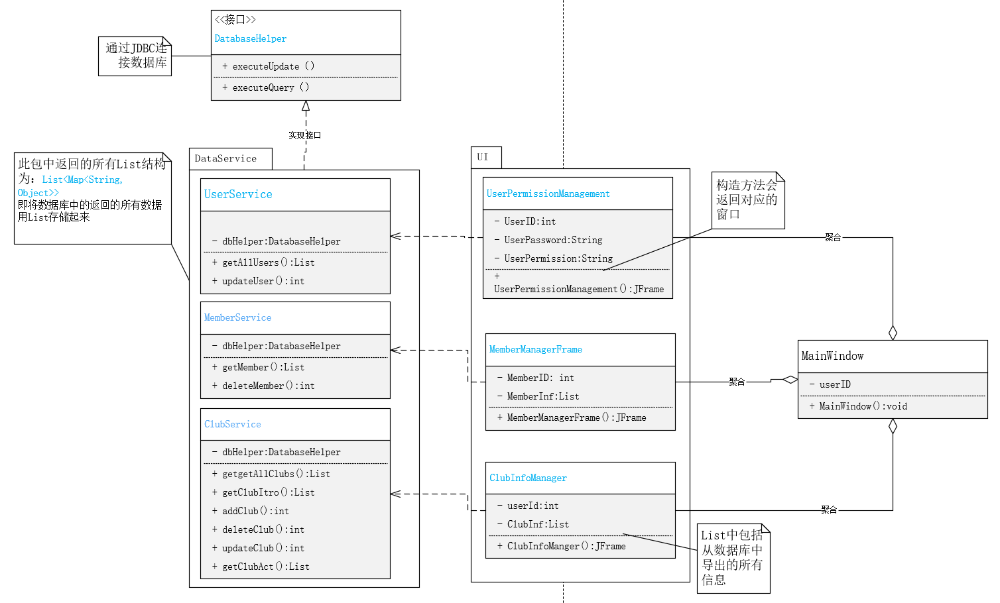
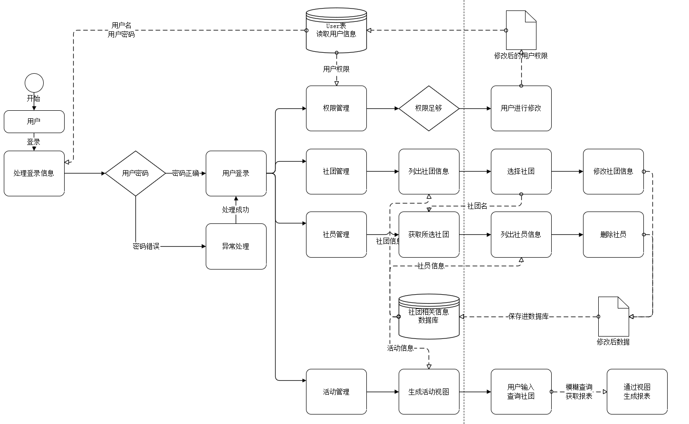
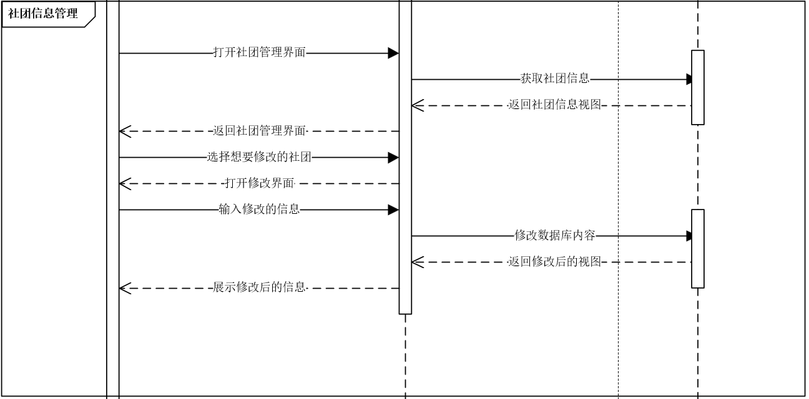
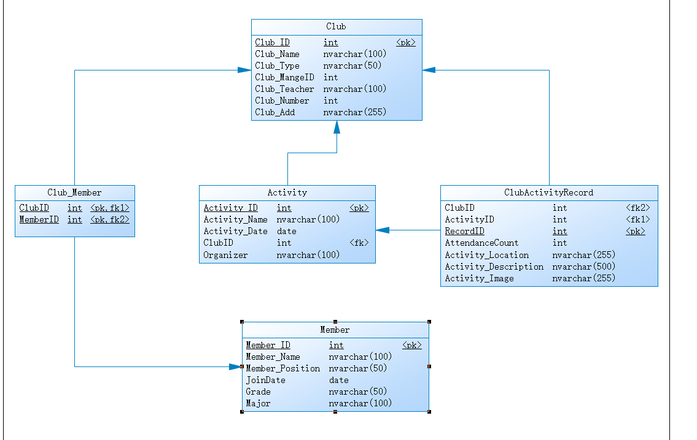

| Diagram                                          | Name               | Description                                     |
| ------------------------------------------------ | ------------------ | ----------------------------------------------- |
|  | `architecture.png` | Overall architecture and class relationships    |
|          | `workflow.png`     | Login & permission management workflow          |
|          | `sequence.png`     | Sequence of updating club information           |
|              | `er-diagram.png`   | Database ER diagram showing all table relations |

